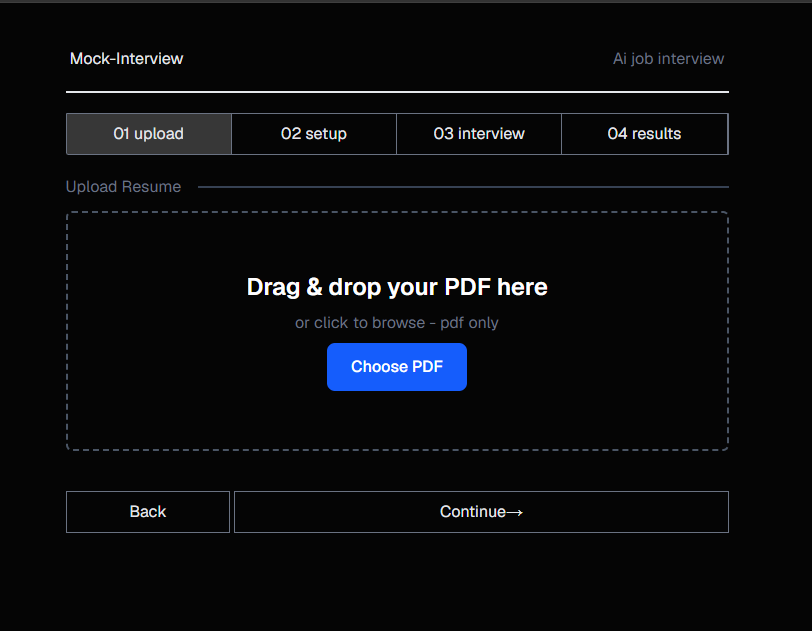
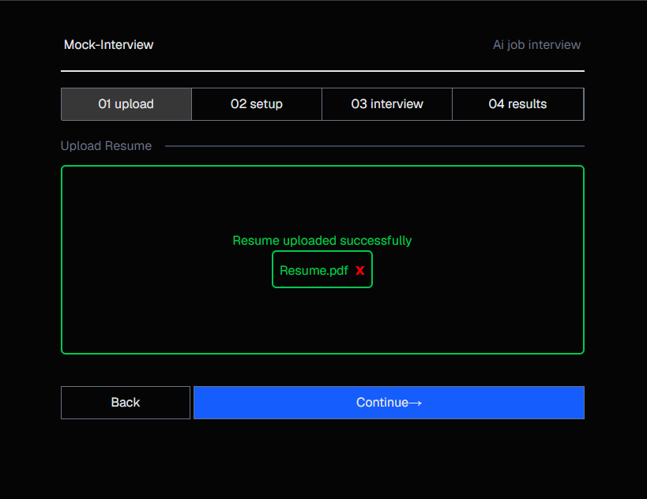
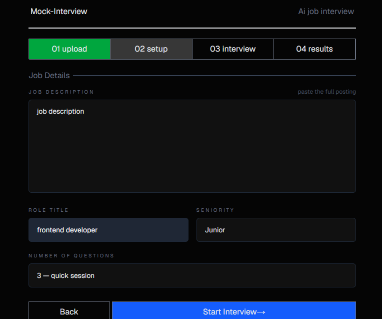
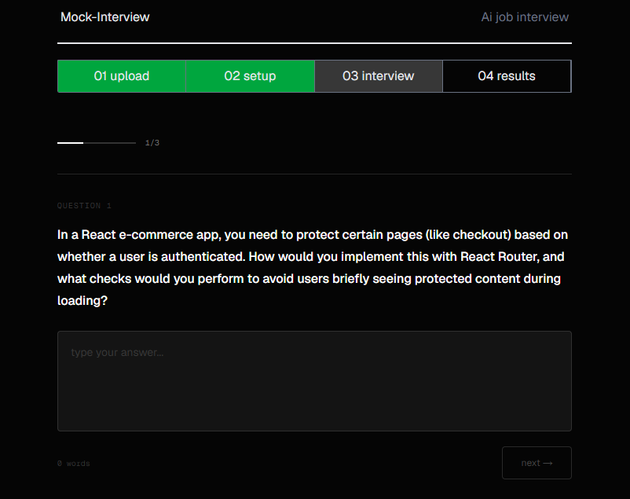
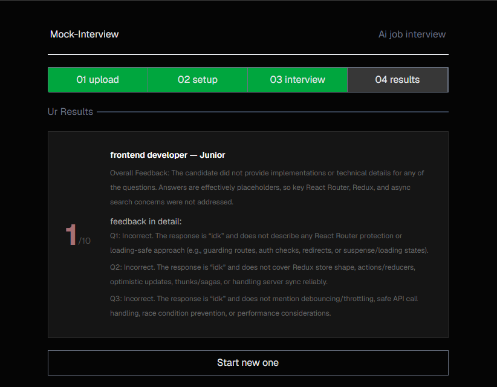

# Mock Interview

A modern web application that helps users prepare for technical interviews through AI-powered mock interview sessions. The app generates customized interview questions based on your resume and target job details, then evaluates your responses.

## 📸 Screenshots

| Upload Resume                 | Resume Uploaded                 |
| ----------------------------- | ------------------------------- |
|  |  |

| job Details                       | Interview                        |
| --------------------------------- | -------------------------------- |
|  |  |

| Results  
| ---------------------------
| 

## 🎯 Features

- **Resume Upload**: Upload your resume as a PDF file with automatic text extraction
- **Job Details Configuration**: Specify the role, seniority level, and job description for targeted questions
- **AI-Generated Questions**: Automatically generates interview questions relevant to the role and your background
- **Interactive Interview**: Answer questions in a structured interview format
- **AI Evaluation**: Get AI-powered feedback and assessment of your responses
- **Progress Tracking**: Multi-stage workflow to guide users through the entire interview process

## 🛠️ Tech Stack

- **Frontend Framework**: [Next.js 16](https://nextjs.org/) with React 19
- **State Management**: [Redux Toolkit](https://redux-toolkit.js.org/)
- **Styling**: [Tailwind CSS 4](https://tailwindcss.com/)
- **Language**: [TypeScript](https://www.typescriptlang.org/)
- **AI Integration**: [Puter.ai](https://puter.com/) for question generation and response evaluation
- **PDF Processing**: [react-pdftotext](https://www.npmjs.com/package/react-pdftotext) for resume extraction

## 📁 Project Structure

```
app/
├── layout.tsx              # Root layout component
├── page.tsx                # Main upload page
├── globals.css             # Global styles
├── storeProvider.tsx       # Redux provider setup
├── handelResume/           # Resume handling
│   ├── uploadResume.tsx    # Resume upload component
│   └── extractResume.ts    # PDF text extraction logic
├── setup/                  # Job details configuration
│   ├── jobDetails.tsx      # Job details form component
│   └── page.tsx
├── interview/              # Interview questions & answers
│   ├── interview.tsx       # Interview component
│   └── page.tsx
├── puter.js/               # AI integration
│   ├── GenerateQuestions.ts # Question generation logic
│   ├── GenerateResults.ts  # Response evaluation logic
│   └── puter.d.ts          # Puter.ai type definitions
├── results/                # Final results display
│   ├── results.tsx         # Results component
│   └── page.tsx
└── shared/                 # Shared components
    ├── navbar.tsx
    └── footer.tsx

redux/
├── store.ts                # Redux store configuration
├── stageSlice.ts           # Handel which stage user is in
├── isResumeUpSlice.ts      # Resume upload status
├── interviewSlice.ts       # Handel Questions and Answers, in turn results
└── jobDetailsSlice.ts      # Job details data


```

## 📋 User Workflow

1. **Upload Resume**: Start by uploading your PDF resume
   - The app automatically extracts text from the PDF
   - Resume content is stored in Redux state

2. **Enter Job Details**: Configure interview parameters
   - Job title/role
   - Seniority level
   - Job description
   - Number of questions to generate

3. **Take Interview**: Answer AI-generated questions
   - Questions are tailored to your resume and target role
   - Answer each question in the interview format
   - Track progress through the interview

4. **View Results**: Get AI-powered evaluation
   - Assessment of your responses
   - Feedback on strengths and areas for improvement

The app integrates with Puter.ai for:

- **Question Generation**: Creates relevant interview questions based on resume + job details
- **Response Evaluation**: Analyzes user answers and provides feedback

**Note**: Make sure to configure Puter.ai credentials as required for AI features to function properly.

## 🌐 Live Demo

**Demo:** https://ahmdgoud.github.io/Mock-Interview/

## 👨‍💻 Author

**Ahmed AbdelRahman**

- Portfolio: https://ahmdgoud.github.io/AhmedAbdelRahman/
- LinkedIn: https://www.linkedin.com/in/ahmed-abdelrahman-7ab52b231/
